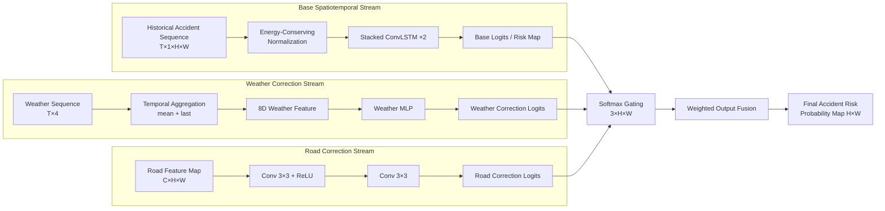
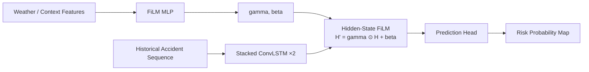
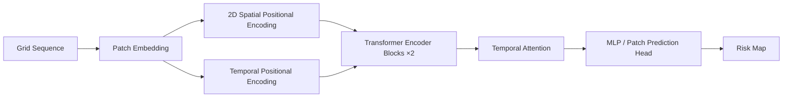
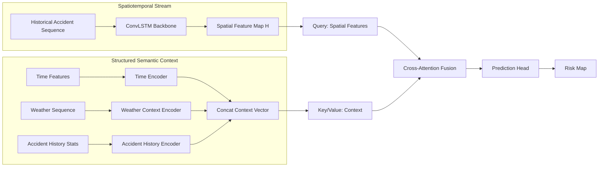
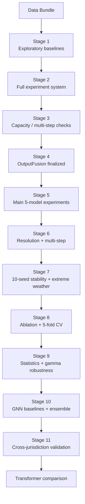

# Case Library: OutputFusion and Spatiotemporal Risk Models

This optional case library contains diagram-ready examples from a spatiotemporal risk-modeling project. Use it only when the user explicitly asks for a bundled case study or names one of the architectures below.

These examples are provided as reusable architecture patterns, not as default assumptions for unrelated projects.

## Case vocabulary

Model names and aliases:

- `OutputFusion`, `OutputFusionPredictor`, `OutputFusion (+W+R)`
- `ConvLSTMFusionPredictor`, `ConvLSTM baseline`, `FiLM hidden-layer fusion`
- `SpatioTemporalTransformer`, `TransformerPredictor`, `STAEformer-style Transformer`, `Transformer+W+R`
- `DualStreamV2`, `StructuredContextEncoderModel`, `CrossAttentionFusion`
- `STGCN`, `STGCNPredictor`
- `DCRNN`, `DCRNNPredictor`
- `GWNet`, `GWNetPredictor`, `Graph WaveNet`
- `CNNGridPredictor`, `LSTMGridPredictor`, `BiLSTMGridPredictor`, `KNN`, `Persistence`

Key phrases to preserve when this case is explicitly requested:

- `output-layer fusion`
- `Softmax gating`
- `weighted output fusion`
- `energy-conserving normalization`
- `hidden-layer fusion`
- `FiLM modulation`
- `cross-attention fusion`
- `structured semantic context`
- `extremely sparse accident prediction`
- `cross-jurisdiction validation`

## OutputFusionPredictor flagship template

Use this as the default template only for OutputFusion architecture requests.

### Concept

OutputFusion decouples spatiotemporal accident modeling from weather/road feature correction. ConvLSTM learns the historical accident pattern. Weather and road encoders produce independent correction logits. The three output maps are fused at the output layer through softmax-gated weighted sum.

### Mermaid skeleton



### Required fidelity checks

- Must show exactly three streams unless the user requests an ablation.
- Must show fusion at the output/logits level, not inside ConvLSTM hidden states.
- Must label the fusion as `Softmax Gating` or `Softmax-Gated Weighted Sum`.
- Weather stream should include aggregation into mean + last-step features when medium/high detail.
- Road stream should be a 2-layer convolution encoder when medium/high detail.

## OutputFusion vs FiLM comparison

Use for ablation or “fusion position” diagrams.

Essential contrast:

- FiLM: external features generate `γ, β`; hidden state is modulated as `H' = γ ⊙ H + β`; this is hidden-layer fusion.
- OutputFusion: external features produce output correction logits; three logits streams are fused by softmax gating; this is output-layer fusion.

Suggested visual structure:

```text
Left cluster: FiLM hidden-layer fusion
Right cluster: OutputFusion output-layer fusion
Center/bottom annotation: fusion position determines whether external features disturb spatiotemporal hidden states
```

## ConvLSTMFusionPredictor template

Use for ConvLSTM baseline or FiLM weather modulation requests.



For pure ConvLSTM baseline, omit weather/FiLM branch:

```text
Historical sequence → Stacked ConvLSTM ×2 → Prediction head → Risk map
```

## SpatioTemporalTransformer template

Use for STAEformer-style baseline or Transformer comparison requests.



Important notes:
- Include patching when the request concerns large-grid sparse accident prediction.
- If comparing with ConvLSTM, label patching as a possible spatial-resolution bottleneck only if the user asks for explanatory notes.

## DualStreamV2 template

Use for structured context / cross-attention requests.



Required fidelity:
- Show structured context encoders separately.
- Show cross-attention as feature-space fusion, not output-layer softmax gating.

## GNN baseline templates

### STGCN

```text
Grid/node features + adjacency → Chebyshev Graph Conv → Temporal Conv → STConv Block ×N → Readout/Upsample → Risk map
```

### DCRNN

```text
Node features + diffusion adjacency → Diffusion Convolution → DCGRU recurrent update → Node predictions → Grid risk map
```

### Graph WaveNet / GWNet

```text
Node features + adaptive adjacency → Dilated Causal Conv → Graph Convolution → GWNet Block ×N → Prediction head
```

### Generic graph pipeline pattern

```text
Grid accident maps → grid_to_node_features / aggregate_grid → GNN blocks → node_to_grid / upsample_grid → risk map
```

## Experiment pipeline template

Use only when the user asks for this case-study workflow or supplies matching stage names.

Compact stage flow:



## Data cleaning pipeline template

```text
Raw accident records → timestamp parsing / invalid removal → numeric coercion → coordinate validation + projection → spatial clipping → deduplication → grid/time-window construction → train/val/test split
```

## Cross-jurisdiction validation template

```text
Yinzhou training/evaluation → OutputFusion learned mechanism → Jiangbei independent dataset → 10-seed paired comparison → AUPRC/F1 statistical tests → cross-jurisdiction conclusion
```
