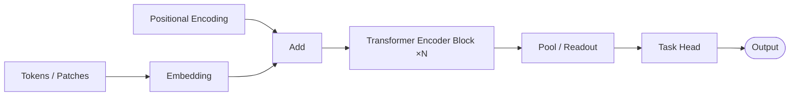
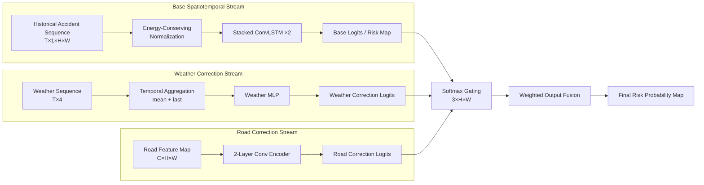
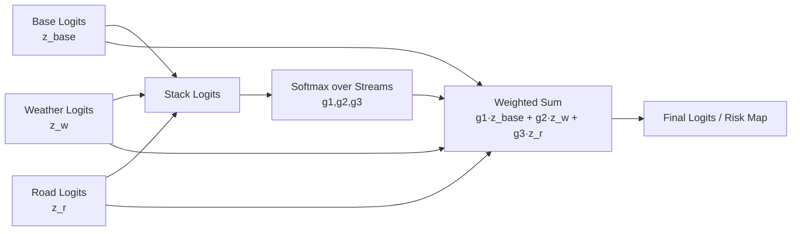

# NN Diagram Examples

These examples define the preferred response style. Keep real responses concise: one interpretation sentence, one code block, optional assumptions.

## 1. Generic Transformer encoder

User:

```text
Draw a Transformer encoder architecture in Mermaid.
```

Response pattern:

````text
Using architecture mode with the generic Transformer template in Mermaid, medium detail, left-to-right layout.


````

## 2. U-Net segmentation

User:

```text
画一个 U-Net，medium detail。
```

Response should show encoder, bottleneck, decoder, upsampling, output mask/map, and skip connections from matching encoder levels to decoder levels.

## 3. ConvLSTM cell gates

User:

```text
画 ConvLSTM cell 的门控结构。
```

Response should show `X_t`, `H_{t-1}`, convolutional gates, candidate state, `C_t`, and `H_t`.

## 4. Multimodal fusion

User:

```text
Draw an image-text fusion model with cross-attention.
```

Response should keep image and text streams separate until the stated cross-attention or fusion block, then show the shared representation and task head.

## 5. RAG pipeline

User:

```text
画一个 RAG 问答系统流程图，用 Mermaid。
```

Response should separate offline indexing from online retrieval when both are requested. Minimum online flow:


## 6. Agent loop

User:

```text
Draw an AI agent that plans, calls tools, observes results, and updates memory.
```

Response should show the plan-act-observe loop, external tool boundary, memory/state update, and final response/action.

## 7. GNN baseline comparison

User:

```text
Compare STGCN, DCRNN, and Graph WaveNet in one diagram.
```

Response should group each model in a subgraph and preserve its canonical operation:
- STGCN: graph convolution + temporal convolution.
- DCRNN: diffusion convolution + recurrent update.
- Graph WaveNet: adaptive graph convolution + dilated causal convolution.

## 8. Training pipeline

User:

```text
画一个模型训练和评估流程图。
```

Response should use `flowchart TD` and include preprocessing, split, training, validation/tuning, test evaluation, and reporting/deployment artifact.

## 9. SVG request

User:

```text
Give me an editable SVG for a two-stream fusion model.
```

Response should output raw SVG, not Mermaid, and preserve semantic groups such as `stream-a`, `stream-b`, and `fusion`.

## 10. Ambiguous request

User:

```text
帮我画网络结构图。
```

If no model details are present, ask one targeted question:

```text
你要画哪类结构？可以选：Transformer、U-Net、GNN、RAG/Agent workflow，或直接贴模块列表。
```

Do not guess a specific model family when no cues exist.

## 11. Under-specified but inferable request

User:

```text
Draw a ResNet block.
```

Do not ask. Use defaults:
- mode `block-detail`
- format Mermaid
- medium detail
- left-to-right

## Case Library / 案例库

Use these only when the user names a bundled case or asks for case-library examples.

### OutputFusion architecture

User:

```text
画 OutputFusionPredictor 架构图，用 Mermaid。
```

Response pattern:

````text
Using architecture mode with the bundled OutputFusion case-library template in Mermaid, medium detail, left-to-right layout.


````

### OutputFusion vs FiLM

Response should show:
- FiLM branch modulates hidden state.
- OutputFusion fuses logits/output maps.
- The contrast is fusion position.

### Softmax gating block detail

Response should include:



### Stage pipeline

For OutputFusion stage workflows, use `flowchart TD` and stage names from `case-library.md`.
