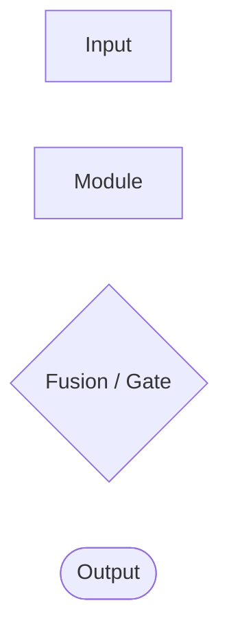
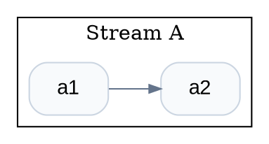

# Output Format Rules

The skill emits editable diagram source by default. Do not output bitmap-only instructions unless the user explicitly wants image-generation prompts.

## Format choice

Default order:

1. Mermaid — default for most requests.
2. Graphviz DOT — use for large DAGs, clusters, or taxonomy-style comparisons.
3. SVG — use only when explicitly requested.

If the user asks for “画图” without a format, output Mermaid. If they ask for “可编辑矢量图”, “SVG”, “论文级矢量”, or “直接可保存的图”, output SVG or offer SVG after Mermaid depending on request specificity.

## Mermaid rules

Use:

```mermaid
flowchart LR
```

or:

```mermaid
flowchart TD
```

Default orientation:
- `LR` for architecture and comparison diagrams.
- `TD` for pipelines and staged workflows.

Conventions:
- Use `subgraph` for streams, encoder/decoder halves, model families, or experiment stages.
- Keep node IDs short and stable, e.g. `X`, `CL`, `G`, `Y`, `S1`, `S2`.
- Escape line breaks inside labels with `<br/>` for maximum Mermaid compatibility.
- Avoid heavy styling unless requested. If styling is useful, keep it minimal and apply by class.
- Avoid labels longer than two short lines.
- Use explicit edge labels only when they clarify a mechanism, e.g. `-- gamma,beta -->`.

Preferred Mermaid shapes:



Use diamond gates sparingly; in many renderers, rectangular fusion nodes are more readable for long technical labels.

## Graphviz DOT rules

Use DOT for cluster-heavy diagrams:



Conventions:
- `rankdir=LR` for architectures, `rankdir=TB` for pipelines.
- Use `cluster_*` for streams/families.
- Use `shape=diamond` for decision/gating nodes only when labels are short.
- Use `penwidth=2` for core innovation nodes, not for every node.

## SVG rules

Only output raw SVG when explicitly requested.

SVG requirements:
- Include `viewBox`.
- Use semantic group IDs such as `stream-base`, `stream-weather`, `stream-road`, `fusion-softmax`.
- Use flat vector style: white or very light background, restrained colors, no glow, no 3D, no decorative gradients.
- Keep text horizontal and readable.
- Put arrows behind node text.
- Use concise labels.
- Prefer simple reusable classes in `<style>`.

Minimum SVG structure:

```svg
<svg xmlns="http://www.w3.org/2000/svg" viewBox="0 0 1200 700" role="img" aria-labelledby="title desc">
  <title id="title">Diagram title</title>
  <desc id="desc">Short description.</desc>
  <style>
    .node { fill: #f8fafc; stroke: #94a3b8; stroke-width: 1.5; rx: 10; }
    .core { fill: #e0f2fe; stroke: #0284c7; stroke-width: 2; }
    .arrow { stroke: #475569; stroke-width: 1.6; fill: none; marker-end: url(#arrow); }
    text { font-family: Arial, sans-serif; font-size: 15px; fill: #0f172a; }
  </style>
</svg>
```

## Response wrapping

Use fenced code blocks with the correct language tag:

- Mermaid: <code>```mermaid</code>
- DOT: <code>```dot</code>
- SVG: <code>```svg</code>

Do not put explanatory prose inside the code block.

## Caption rules

When the user asks for `source+caption`, add a short caption after the code block:

- State what the diagram shows.
- Mention the fusion mechanism or key architecture choice.
- Avoid performance claims unless the user supplied the evidence.

## Syntax self-check

Before delivering:

- Mermaid has exactly one root declaration: `flowchart LR` or `flowchart TD`.
- All Mermaid node IDs used in edges are defined or implicitly defined once.
- DOT braces are balanced.
- SVG tags are balanced and include `xmlns` and `viewBox`.
- No unsupported Markdown is inside diagram code fences.
